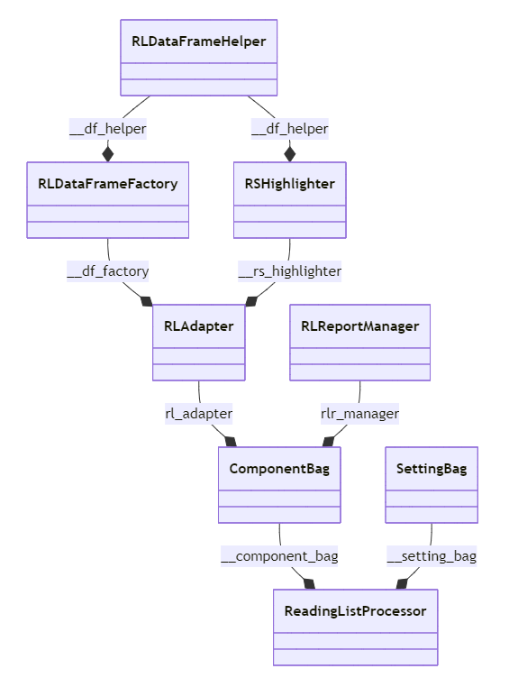

# nwreadinglist
Contact: numbworks@gmail.com

## Revision History

| Date | Author | Description |
|---|---|---|
| 2023-08-10 | numbworks | Created. |
| 2026-05-12 | numbworks | Last update (6.0.0). |

## Introduction

`nwreadinglist` is a library that can run several automated data‑analysis tasks on a reading list and save the results as a PDF report. It’s designed to facilitate and gamify a continuous learning journey.

## Architecture

A partial class diagram showing the core architecture of the application:



## See Also: `developmentguide`

To get started with this project as a developer, please give a look to the following document:

- [docs-developmentguide-python.md](SeeAlso-developmentguide/docs-developmentguide-python.md)

## See Also: `asciibannermanager`

This project includes portions of the `asciibannermanager` project, which is documented here:

- [docs-asciibannermanager.md](SeeAlso-asciibannermanager/docs-asciibannermanager.md)

## See Also: `nwbuilders`

This project includes portions of the `nwbuilders` project, which is documented here:

- [docs-nwbuilders-python.md](SeeAlso-nwbuilders/docs-nwbuilders-python.md)

## See Also: `nwmakefiles`

This project includes portions of the `nwmakefiles` project, which is documented here:

- [docs-nwmakefiles.md](SeeAlso-nwmakefiles/docs-nwmakefiles.md)

## Known Issues: "ImportError: cannot import name 'display' from 'IPython.core.display'"

Starting `v4.3.0`, the devcontainer's Dockerfile forces `ipkernel` to use a specific version of its `ipython` dependency:

```
FROM python:3.12.5-bookworm

# ...
RUN pip install ipykernel==6.29.5 ipython==7.23.1
# ...
```

Without this enforcement in place, the devcontainer would return the following error message:

> ImportError: cannot import name 'display' from 'IPython.core.display'

By investigating the dependency tree with the following commands:

```
pip install pipdeptree
pipdeptree -p ipykernel
```

I discovered that `ipykernel` has the following (very lousy) dependency constraint:

```
...
├── ipython [required: >=7.23.1, ...
...
```

The `>=` means that, even if your devcontainer uses a frozen version of `ipykernel`, the latest version of `ipython` will be downloaded at each rebuild.

When I started getting the error message, the installed `ipython` version was `9.2.0` (quite far from the original `7.23.1`). 

Forcing `pip` to use an older dependency was necessary to bring back the devcontainer to a working status.

## Known Issues: "ModuleNotFoundError: No module named 'tinycss2.color5'"

At the moment of writing, the latest version of `weasyprint` is `67.0`, but it returns the following error if run via devcontainer:

```
2025-12-22 19:40:18.005 [error] Unittest test discovery error for workspace:  /workspaces/nwreadinglist 
 Failed to import test module: nwreadinglisttests
Traceback (most recent call last):
  File "/usr/local/lib/python3.12/unittest/loader.py", line 396, in _find_test_path
    module = self._get_module_from_name(name)
             ^^^^^^^^^^^^^^^^^^^^^^^^^^^^^^^^
  File "/usr/local/lib/python3.12/unittest/loader.py", line 339, in _get_module_from_name
    __import__(name)
  File "/workspaces/nwreadinglist/tests/nwreadinglisttests.py", line 17, in <module>
    from nwreadinglist import RLCN, DEFINITIONSTR, OPTION, REPORTSTR, _MessageCollection, RLSummary, DefaultPathProvider
  File "/workspaces/nwreadinglist/src/nwreadinglist.py", line 25, in <module>
    from weasyprint import CSS, HTML
  File "/usr/local/lib/python3.12/site-packages/weasyprint/__init__.py", line 440, in <module>
    from .css import preprocess_stylesheet  # noqa: I001, E402
    ^^^^^^^^^^^^^^^^^^^^^^^^^^^^^^^^^^^^^^
  File "/usr/local/lib/python3.12/site-packages/weasyprint/css/__init__.py", line 32, in <module>
    from . import counters, media_queries
  File "/usr/local/lib/python3.12/site-packages/weasyprint/css/counters.py", line 10, in <module>
    from .tokens import remove_whitespace
  File "/usr/local/lib/python3.12/site-packages/weasyprint/css/tokens.py", line 8, in <module>
    from tinycss2.color5 import parse_color
ModuleNotFoundError: No module named 'tinycss2.color5'

2025-12-22 19:40:18.229 [info] Unittest discovery completed for workspace /workspaces/nwreadinglist
```

The root cause of the issue is that `weasyprint 67.0` forces the installation of `tinycss2 1.4.0` (which doesn't support `tinycss2.color5`), and even asking the Dockerfile to enforce the installation of `tinycss2 1.5.0` (which supports `tinycss2.color5`) doesn't work (`tinycss2` stays on `1.4.0`). 

To solve the issue we use the older `weasyprint 66.0`:

```
...
RUN pip install weasyprint==66.0
...
```

## Known Issues: Pandas 2.2.x and its warnings

`Pandas 2.2.0` introduced several warnings related to the "Copy-on-Write" feature planned for `Pandas 3.0.0`, such as:

```
...
/tmp/onefile_3061176_1779002299_484551/nwreadinglist.py:853: ChainedAssignmentError: A value is trying to be set on a copy of a DataFrame or Series through chained assignment.
When using the Copy-on-Write mode, such chained assignment never works to update the original DataFrame or Series, because the intermediate object on which we are setting values always behaves as a copy.

Try using '.loc[row_indexer, col_indexer] = value' instead, to perform the assignment in a single step.

See the caveats in the documentation: https://pandas.pydata.org/pandas-docs/stable/user_guide/indexing.html#returning-a-view-versus-a-copy
...
```

The goal was to prepare users for the breaking change by flooding the console with warning messages. 

This (quite questionable) strategy had a strong impact on my building pipeline based upon `Nuitka 2.8.9`, because these warnings, which weren't shown at all during development in Visual Studio Code, appeared auto-magically in the terminal while running the compiled application. 

The behaviour is confirmed by the following online resources:

- [Pandas 2.2.0 release notes](https://github.com/pandas-dev/pandas/blob/9993ce6161342306500378d44700daccbd9f7aa3/doc/source/whatsnew/v2.2.0.rst#L569)
- [Issue #1395 on Nuitka's Github](https://github.com/Nuitka/Nuitka/issues/3715)
- [Question #78838272 on StackOverflow](https://stackoverflow.com/questions/78838272/cython-and-pandas-chainedassignmenterror-issue-handling-reference-count-discrep)

My first attempt to solve the problem was to make the code highligted by the warnings compliant with "Copy-on-Write" - e.g.:

  - Example 1
    ```
    rl_df = rl_df[column_names]
    ...
    ```
    ```
    rl_df = rl_df[column_names].copy()
    ...
    ```

  - Example 2
    ```
    rls_by_year_df.drop(labels = RLCN.MONTH, inplace = True, axis = 1)
    rls_by_year_df.drop(labels = RLCN.TRENDSYMBOL, inplace = True, axis = 1)
    ...
    ```
    ```
    rls_by_year_df = rls_by_year_df.drop(labels = RLCN.MONTH, axis = 1)
    rls_by_year_df = rls_by_year_df.drop(labels = RLCN.TRENDSYMBOL, axis = 1)
    ...
    ```

  - Example 3

    ```
    filtered_df = filtered_df.loc[condition]
    ...
    ```
    ```
    filtered_df = filtered_df.loc[condition].copy()
    ...
    ```

The first attempt didn't work, the warnings kept appearing.

My second attempt to solve the problem was to add the following block of code at the top of the module, but it didn't solve the problem either:

```python
import warnings
import pandas as pd
pd.options.mode.copy_on_write = True

if "__compiled__" in globals():
    warnings.filterwarnings(
      action = "ignore", 
      message = ".*ChainedAssignmentError.*"
    )
else:
    warnings.filterwarnings(
      action = "error", 
      message = ".*ChainedAssignmentError.*"
    )
```

My third attempt was to downgrade `Pandas` to the latest available version before `2.2.0`, and adjust `numpy` and `pandas-stubs` accordingly. This led me to keep these as-is:

```
Python 3.12.5
nuitka==2.8.9
```

but to downgrade these:

```
numpy==2.1.2
pandas==2.2.3
pandas-stubs==2.2.3.241009
```

to these:

```
numpy==1.26.4
pandas==2.1.4
pandas-stubs==2.1.4.231227
```

My third attempt was successful.

## Markdown Toolset

Suggested toolset to view and edit this Markdown file:

- [Visual Studio Code](https://code.visualstudio.com/)
- [Markdown Preview Enhanced](https://marketplace.visualstudio.com/items?itemName=shd101wyy.markdown-preview-enhanced)
- [Markdown PDF](https://marketplace.visualstudio.com/items?itemName=yzane.markdown-pdf)